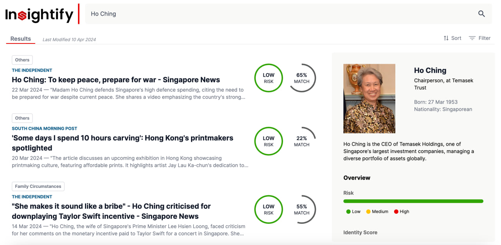

<div align="center">
  
  <p>
    Client News Screening - Insightify
  </p>
</div>

## Table of Contents

<details id="table-of-contents">
    <summary>Content Page</summary>
    <br>
    <ol>
        <li>
            <a href="#introduction">Introduction</a>
        </li>
        <li>
            <a href="#important-features">Important Features</a>
        </li>
        <li>
            <a href="#system-architecture">System Architecture</a>
        </li>
        <li>
            <a href="#microservice-architecture">Microservice Architecture</a>
        </li>
        <li>
            <a href="#getting-started">Getting Started</a>
        </li>
        <li>
            <a href="#ci-cd">CI/CD</a>
        </li>
        <li>
            <a href="#styling">Styling</a>
        </li>
    </ol>
</details>

## Introduction

<br>
<div align="center">
	
</div>

The objective of our application is to smoothen and automate the KYC process for banks. Our application uses `Next.js` for the frontend, `Python FastAPI` as the API backend, `Tailwind` for the CSS styling library and is deployed on `Azure Cloud` via k8s and Docker containers. Automated Docs with Swagger UI has been set up under the /docs route.

On localhost, the rewrite will be made to the `127.0.0.1:8000` port, which is where the FastAPI server is running. The frontend NextJs app is routed by default to the `127.0.0.1:3000` port.

<p align="right">(<a href="#table-of-contents">back to top</a>)</p>

## Important Features

<ol>
    <li>
        Overview of all News Articles
        <ul>
            <li>Risk Levels</li>
            <li>Identity Score</li>
            <li>Categories</li>
            <li>News Roundup (Articles with >75% Identity Match)</li>
        </ul>
    </li>
    <li>View Summary of News Articles for selected client</li>
    <li>View Risk Ratings and Identity Matching Score of News Articles</li>
    <li>Sort and Filter by Category, Risk Rating and Identity Match</li>
</ol>
<p align="right">(<a href="#table-of-contents">back to top</a>)</p>

## System Architecture

<div align="center">
	
</div>

<p align="right">(<a href="#table-of-contents">back to top</a>)</p>

## Microservice Architecture

<div align="center">
	
</div>

<p align="right">(<a href="#table-of-contents">back to top</a>)</p>

## Getting Started

<b>Prerequisites</b>: Node.js > v18.17 , Python > v3.8 to run application on local server.

#### Setting up frontend
First, install the dependencies
```bash
npm i
or
npm install
```

#### Setting up backend
Then, install backend packages
```bash
cd backend
pip install requirements.txt
or
pip3 install requirements.txt
```

#### Setting up Environment Variables
Following the `.env.example` file create a `.env` file with the same fields and populate it with the appropriate fields. `Please contact us for our API Keys and credentials`

Then, run the development server:
```bash
npm run dev
&& 
uvicorn backend.api.searchAPI.main:app --port 8000  & uvicorn backend.api.personAPI.main:app --port 8001 & uvicorn backend.api.newsAPI.main:app --port 8002  & uvicorn backend.api.identityAPI.main:app --port 8003 & uvicorn backend.api.analyticsAPI.main:app --port 8004
```

The FastApi server (searchAPI Complex Microservice) will be running on `http://127.0.0.1:8000`, while the NextJs frontend will be running on `http://127.0.0.1:3000`.

#### Running Unit and Integration Tests

Run the command below to run all backend unit and integration tests:
```bash
coverage run -m unittest discover backend/tests
```

#### Fixing Typescript Linting error 

1. Install ESLint extension for VSCode, other helpful extensions are Prettier, Tailwind CSS, and Error Lens.
2. Run `npm run airbnb-lint:fix` or `npm run lint:fix` to check for and fix linting errors.
3. If there are errors that cannot be fixed automatically, you will have to check the cli for the errors and fix them manually.

<p align="right">(<a href="#readme-top">back to top</a>)</p>

## Database Migrations

With Alembic, revisions to models via sqlalchemy can be used to automatically migrate the database, reducing the hassle of manual database reconfiguration 

View current DB version
```bash
alembic current
```

After modifying ORM code / models
```bash
alembic revision --autogenerate -m "YOUR MIGRATION MESSAGE"
```

After checking the generated revisions are okay
```bash
alembic upgrade HEAD 
# alternatively specify the revision hash initials to upgrade to a specific version
```

To downgrade to the previous version
```bash
alembic downgrade -1
# alternatively specify the revision hash initials to downgrade to a specific version 
# or alembic downgrade base to reset to initial state
```
<p align="right">(<a href="#readme-top">back to top</a>)</p>

## CI/CD 

We have one CI workflow: `pipeline.yml` and one CD workflow: `cd-pipeline.yaml` that runs after the CI pipeline is completed. These integrations are run on every push to main - CI piepline is run on every branch while CD pipeline is only run on push to main.

Within each workflow, we run an assortment of checks and tests to ensure that the code is up to standard. These include:
- npm-vulnerabilities-check
- SAST-scan
- lint-nextjs
- lint-fastapi
- unit-test-fastapi
- sonarqube-scans

We have CD which deploys to production (Azure Kubernetes Service) on every push to main. This is done via the yaml configuration files under the `k8s` folder. There are Dockerfiles for the frontend-service and for each backend API endpoint, and our `cd-pipeline.yaml` builds the Docker images, pushes them to the Docker Registry, pull images from the registry and deploy them to AKS. The environment variables needed for each microservices are stored as GitHub Actions Secrets which will be retrieved when the CD workflow is run. 

The environment variables used for CI and CD workflow includes (stored in GitHub Action Secrets):
* `ANALYTICS_DNS`: Analytics MS AKS ClusterIP
* `AZURE_CREDENTIALS`: AKS Service Principal Details to log in to Azure (including clientId, clientSecret, subscriptionId, tenantId)
* `AZURE_SQL_URL`: Azure SQL DB URL
* `AZURE_STORAGE_CONNECTION_STRING`: Azure Blob Storage Connection URL
* `DOCKER_ACCESS_TOKEN`: Docker Registry Access Token
* `DOCKER_USERNAME`: Docker Registry Username
* `IDENTITY_DNS`: Identity MS AKS ClusterIP
* `NEWS_API_KEY`: NewsAPI API Key
* `NEWS_DNS`: News MS AKS ClusterIP
* `OPENAI_API_KEY`: OpenAI API Key
* `PERSON_DNS`: Person MS AKS ClusterIP
* `PROD`: Production status
* `SEARCH_DNS`: Search MS AKS ClusterIP
* `SONAR_TOKEN`: SonarQube Access Token

<p align="right">(<a href="#readme-top">back to top</a>)</p>

## Styling

Refer to tailwind.config.ts for list of classes (under theme.extend.colors) that can be used to style the components. 

<strong>Do not</strong> use the default tailwind classes.

<p align="right">(<a href="#readme-top">back to top</a>)</p>
